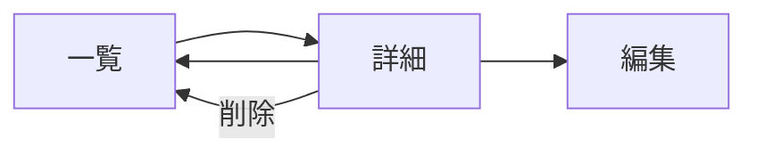

# ダイブログ詳細

## メタ情報

| 項目 | 内容 |
|------|------|
| 画面ID | `dive-detail` |
| 関連機能 | [002 ダイブログ CRUD](../spec.md) |
| ルート | `/dives/[id]` |
| 認証 | 必須 |
| 対応端末 | モバイル / タブレット / PC |
| ステータス | ドラフト |

## 1. 目的・概要

1 本のダイブログの全項目を閲覧する画面。編集・削除の起点となる。非公開の他人のログは RLS により 404 となる。公開ログ（`is_public = true`）は他ユーザーも閲覧のみ可能で、編集・削除ボタンは所有者にのみ表示する（021 以降）。

## 2. 画面構成

### レイアウト

```
┌───────────────────────────────────────┐
│ Header                                  │
├───────────────────────────────────────┤
│ ← 一覧に戻る                           │
├───────────────────────────────────────┤
│ h1: 2026/03/15 石垣島・米原 #042       │
│         [編集]  [削除]                  │
├───────────────────────────────────────┤
│ ▼ 基本情報                              │
│   潜水日 / エントリー / エキジット …    │
├───────────────────────────────────────┤
│ ▼ コンディション                        │
│   天気 / 気温 / 水温 / 透明度 / 流れ …  │
├───────────────────────────────────────┤
│ ▼ 潜水データ                            │
│   最大水深 / 平均水深 / 潜水時間 …      │
├───────────────────────────────────────┤
│ ▼ 装備・ガス                            │
│   タンク / ガス / 残圧 / ウェイト …     │
├───────────────────────────────────────┤
│ ▼ メンバー                              │
│   バディ / インストラクター             │
├───────────────────────────────────────┤
│ ▼ メモ                                  │
│   notes（複数行テキスト）               │
└───────────────────────────────────────┘
```

### 画面要素

| ID | 要素 | 種別 | 表示内容 | 補足 |
|----|------|------|---------|------|
| E1 | 戻るリンク | リンク | `← 一覧に戻る` | `/dives` |
| E2 | ページタイトル | テキスト | `<dive_date> <location> #<dive_number>` | h1。`dive_number` 空時は省略 |
| E3 | 編集ボタン | リンクボタン | `編集` | `/dives/[id]/edit` |
| E4 | 削除ボタン | ボタン | `削除` | E10 ダイアログを開く |
| E5 | 基本情報セクション | 定義リスト | 後述 | `<dl>` |
| E6 | コンディションセクション | 定義リスト | 後述 | `<dl>` |
| E7 | 潜水データセクション | 定義リスト | 後述 | `<dl>` |
| E8 | 装備・ガスセクション | 定義リスト | 後述 | `<dl>` |
| E9 | メモセクション | テキスト | `notes`（改行保持） | 空なら「メモなし」 |
| E10 | 削除確認ダイアログ | モーダル | `本当に削除しますか？` | `role="dialog" aria-modal="true"` |

### 項目定義（セクションごと）

| セクション | 項目 | データソース | 表示形式 | 空時の挙動 |
|----------|------|------------|---------|----------|
| 基本情報 | 潜水日 | `dives.dive_date` | `YYYY/MM/DD` | 必須 |
| 基本情報 | エントリー時刻 | `dives.entry_time` | `HH:mm` | 行ごと非表示 |
| 基本情報 | エキジット時刻 | `dives.exit_time` | `HH:mm` | 行ごと非表示 |
| 基本情報 | ポイント名 | `dives.location` | 文字列 | 必須 |
| 基本情報 | ダイブ形態 | `dives.dive_type` | 文字列 | 行ごと非表示 |
| 基本情報 | 講習ダイブ | `dives.certification_dive` | `はい` / `いいえ` | 常時表示 |
| コンディション | 天気 | `dives.weather` | 文字列 | 行ごと非表示 |
| コンディション | 気温 | `dives.air_temp_c` | `XX.X ℃` | 行ごと非表示 |
| コンディション | 水温 | `dives.water_temp_c` | `XX.X ℃` | 行ごと非表示 |
| コンディション | 透明度 | `dives.visibility_m` | `XX.X m` | 行ごと非表示 |
| コンディション | 波 | `dives.wave` | 文字列 | 行ごと非表示 |
| コンディション | 流れ | `dives.current_condition` | 文字列 | 行ごと非表示 |
| 潜水データ | 最大水深 | `dives.max_depth_m` | `XX.XX m` | 必須 |
| 潜水データ | 平均水深 | `dives.avg_depth_m` | `XX.XX m` | 行ごと非表示 |
| 潜水データ | 潜水時間 | `dives.bottom_time_min` | `XX 分` | 必須 |
| 装備・ガス | タンク種別 | `dives.tank_type` | アルミ / スチール（ラベル表示） | 行ごと非表示 |
| 装備・ガス | タンク容量 | `dives.tank_volume_l` | `XX.X L` | 行ごと非表示 |
| 装備・ガス | ガス種別 | `dives.gas_type` | 文字列 | 行ごと非表示 |
| 装備・ガス | 酸素濃度 | `dives.o2_percent` | `XX.X %` | `gas_type=Nitrox` のみ |
| 装備・ガス | 開始残圧 | `dives.pressure_start_bar` | `XXX bar` | 行ごと非表示 |
| 装備・ガス | 終了残圧 | `dives.pressure_end_bar` | `XXX bar` | 行ごと非表示 |
| 装備・ガス | ウェイト | `dives.weight_kg` | `X.X kg` | 行ごと非表示 |
| 装備・ガス | スーツ | `dives.suit_type` | 文字列 | 行ごと非表示 |
| 装備・ガス | 装備メモ | `dives.equipment_notes` | 文字列 | 行ごと非表示 |
| メンバー | バディ | `dives.buddy_name` | 文字列 | 行ごと非表示 |
| メンバー | インストラクター | `dives.instructor_name` | 文字列 | 行ごと非表示 |
| メモ | メモ | `dives.notes` | 改行保持テキスト | `メモなし` を表示 |

> 注: 「流れ」のデータソースは移行元では `dives.current` と記載されていたが、テーブル定義（[`../data-model.md`](../data-model.md)）では予約語回避のため `current_condition` のため、実装に合わせて修正済み。

## 3. 状態（State）

| 状態 | 条件 | 表示 |
|------|------|------|
| 通常 | 自分のログ | 全項目表示 + 編集・削除ボタン |
| 公開ログ閲覧 | 他人の公開ログ（`is_public = true`） | 閲覧のみ可。編集・削除ボタンは非表示（021 以降） |
| 404 | 非公開の他人のログ / 存在しない id | Next.js の `notFound()` で 404 ページ |
| ローディング | データ取得中 | スケルトン UI |
| 削除確認中 | E4 押下後 | E10 ダイアログ表示、背景はスクロールロック |
| 削除実行中 | E10 の OK 押下後 | E10 の OK ボタンを disabled + スピナー |
| 削除エラー | Server Action 失敗 | トースト通知（`role="alert"`）、ダイアログは閉じない |

## 4. 操作・遷移

| 操作 | トリガー | 遷移先・挙動 |
|------|---------|-------------|
| 一覧に戻る | E1 クリック | `/dives` |
| 編集 | E3 クリック | `/dives/[id]/edit` |
| 削除（起点） | E4 クリック | E10 削除確認ダイアログを開く |
| 削除（確定） | E10 の `削除する` | Server Action → 成功時 `/dives` へリダイレクト + トースト |
| 削除（キャンセル） | E10 の `キャンセル` or Esc | ダイアログを閉じる |

### 画面遷移図



## 5. 削除確認ダイアログ仕様

- `role="dialog" aria-modal="true" aria-labelledby="..."`
- フォーカストラップ：開いた瞬間「キャンセル」にフォーカス
- Esc キーで閉じる
- 背景クリックで閉じる（ただし削除実行中は無効）
- ボタン: `キャンセル`（secondary）/ `削除する`（destructive）

## 6. アクセシビリティ要件

- セクション見出しは `h2`、画面タイトルは `h1`、それ以下は `h3`
- 各セクションは `<section aria-labelledby="...">` で構造化
- 定義リストは `<dl><dt><dd>` を使用
- 削除ダイアログは前述のとおりフォーカストラップ + Esc 対応
- 削除実行中ボタンは `aria-busy="true"`
- 操作完了トーストは `role="status" aria-live="polite"`、エラートーストは `role="alert"`

詳細は `.claude/rules/accessibility.md` に準拠。

## 7. レスポンシブ

| ブレークポイント | レイアウト変化 |
|----------------|--------------|
| `< 768px` | 1 カラム、定義リストは縦並び（`dt` → `dd`） |
| `>= 768px` | 1 カラム（最大 720px）、定義リストは 2 カラム（`dt` 左 / `dd` 右） |

## 8. 表示条件・権限

- 認証済みユーザーのみ閲覧可能
- 自分のログと他人の公開ログ（`is_public = true`）のみ閲覧可能（RLS で保証、非公開の他人のログは 404）
- 編集・削除ボタンは所有者のみに表示（021 以降）

## 9. 関連リソース

- 機能仕様: [`../spec.md`](../spec.md)
- 実装計画: [`../plan.md`](../plan.md)
- テーブル定義: [`../data-model.md`](../data-model.md)
- 実装: `service-front/src/app/(authenticated)/dives/[id]/page.tsx`
- 関連画面: [`dive-list.md`](dive-list.md) / [`dive-edit.md`](dive-edit.md)

## 10. 変更履歴

| 日付 | 変更内容 | 担当 |
|------|---------|------|
| 2026-05-27 | 初版作成 | - |
| 2026-06-10 | spec-kit 形式（`specs/002-dive-log-crud/screens/`）へ移行。「流れ」のデータソースを `current_condition` に修正 | - |
