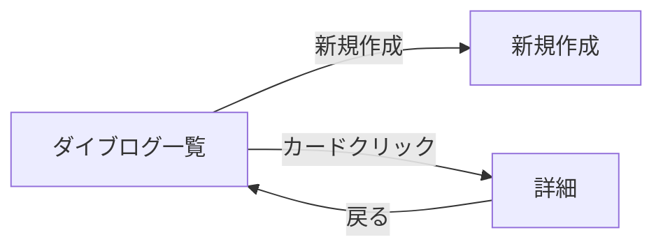

# ダイブログ一覧

## メタ情報

| 項目 | 内容 |
|------|------|
| 画面ID | `dive-list` |
| 関連機能 | [002 ダイブログ CRUD](../spec.md) |
| ルート | `/dives` |
| 認証 | 必須 |
| 対応端末 | モバイル / タブレット / PC |
| ステータス | ドラフト |

## 1. 目的・概要

認証済みユーザーが自分のダイブログを **日付降順** で振り返り、検索・絞り込みから詳細画面に遷移するためのハブ画面。新規作成画面への導線も提供する。

## 2. 画面構成

### レイアウト

```
┌─────────────────────────────────────┐
│ Header                               │
├─────────────────────────────────────┤
│ h1: ダイブログ      [＋ 新規作成]    │
├─────────────────────────────────────┤
│ 検索バー（日付範囲 + ポイント名）     │
├─────────────────────────────────────┤
│ ┌─ DiveCard ──────────────────────┐ │
│ │ 2026/03/15  石垣島・米原          │ │
│ │ 最大 18.5m / 45 分 / バディ: 田中 │ │
│ └─────────────────────────────────┘ │
│ ┌─ DiveCard ──────────────────────┐ │
│ │ ...                              │ │
│ └─────────────────────────────────┘ │
├─────────────────────────────────────┤
│         [もっと見る]                  │
└─────────────────────────────────────┘
```

### 画面要素

| ID | 要素 | 種別 | 表示内容 | 補足 |
|----|------|------|---------|------|
| E1 | ページタイトル | テキスト | `ダイブログ` | h1 |
| E2 | 新規作成ボタン | リンクボタン | `＋ 新規作成` | `/dives/new` へ遷移 |
| E3 | 検索バー | `DiveSearchBar` | 日付From / 日付To / ポイント名 | デバウンス 300ms |
| E4 | リスト | `DiveList`（`role="list"`） | DiveCard を縦に並べる | キーセットページネーション |
| E5 | カード | `DiveCard`（`role="listitem"`） | 後述の項目定義参照 | カード全体が `/dives/[id]` へのリンク |
| E6 | もっと見るボタン | ボタン | `もっと見る` | 次セット取得。最終ページでは非表示 |
| E7 | 空状態 CTA | テキスト + ボタン | `最初のログを記録しよう` | データ 0 件時のみ表示 |
| E8 | 残枠バッジ | `CreditBalanceBadge`（リンク） | `残りログ枠 N` | ヘッダー右側・新規作成ボタンの隣。/settings/log-credits への導線を兼ねる（026 / FR-013） |

### 項目定義（DiveCard 1 件）

| 項目 | データソース | 表示形式 | 補足 |
|------|------------|---------|------|
| 潜水日 | `dives.dive_date` | `YYYY/MM/DD` | 必須 |
| 場所 | `dives.location` | 文字列 | 必須 |
| 最大水深 | `dives.max_depth_m` | `XX.X m` | 必須 |
| 潜水時間 | `dives.bottom_time_min` | `XX 分` | 必須 |
| バディ | `dives.buddy_name` | `バディ: XXX` | 空なら非表示 |
| ダイブ番号 | `dives.dive_number` | `#XXX` | 空なら非表示 |

## 3. 状態（State）

| 状態 | 条件 | 表示 |
|------|------|------|
| 初期表示 | データ 1 件以上 | DiveCard リスト + もっと見るボタン |
| 空 | データ 0 件（検索なし） | E7 空状態 CTA |
| 検索ヒット 0 件 | データ 0 件（検索あり） | `条件に一致するログがありません` |
| ローディング | 初回取得中 | カードスケルトン 3 件 |
| 追加読み込み中 | 「もっと見る」押下後 | E6 をローディング表示 |
| エラー | API エラー | エラーメッセージ + 再試行ボタン |
| 未認証 | セッションなし | `/login` へリダイレクト（middleware） |

## 4. 操作・遷移

| 操作 | トリガー | 遷移先・挙動 |
|------|---------|-------------|
| 新規作成 | E2 クリック | `/dives/new` へ遷移 |
| 詳細表示 | E5（カード）クリック | `/dives/[id]` へ遷移 |
| 検索 | E3 入力 | デバウンス後に URL クエリ更新 + `useDives` 再取得 |
| 追加読み込み | E6 クリック | 次ページを `useDives` で取得しリストに追加 |
| 空状態から作成 | E7 クリック | `/dives/new` へ遷移 |

### 画面遷移図



## 5. 検索仕様

検索条件・URL パラメータの初版仕様（`?diveNumber=&diveDate=&location=`）は **013-dive-search-filters の検索仕様に置換済み**。項目一覧・URL クエリの contract は [`specs/013-dive-search-filters/contracts/search-params.md`](../../013-dive-search-filters/contracts/search-params.md) を参照。

- 並び順: `dive_date desc, id desc`
- ページサイズ: 20

## 6. アクセシビリティ要件

- リストは `<ul role="list">` / カードは `<li role="listitem">`
- カード全体を `<a href="/dives/[id]">` で包む（キーボード操作可能）
- 検索 input にはラベルを付与（視覚非表示でも可、`sr-only`）
- ローディング中は `role="status" aria-live="polite"` を付与
- エラー時は `role="alert"`
- タッチターゲットは 44×44px 以上
- カラーコントラスト比 4.5:1 以上（WCAG 2.1 AA）

詳細は `.claude/rules/accessibility.md` に準拠。

## 7. レスポンシブ

| ブレークポイント | レイアウト変化 |
|----------------|--------------|
| `< 768px` | 1 カラム、検索バーは折りたたみ可能 |
| `>= 768px` | 1 カラム（カード幅は最大 720px）、検索バーは常時表示 |

## 8. 表示条件・権限

- 認証済みユーザーのみ閲覧可能（middleware でガード）
- 表示されるのは `dives.user_id = auth.uid()` のもののみ（RLS で保証）

## 9. 関連リソース

- 機能仕様: [`../spec.md`](../spec.md)
- 実装計画: [`../plan.md`](../plan.md)
- テーブル定義: [`../data-model.md`](../data-model.md)
- 実装: `service-front/src/app/(authenticated)/dives/page.tsx`
- 関連画面: [`dive-detail.md`](dive-detail.md) / [`dive-new.md`](dive-new.md)

## 10. 変更履歴

| 日付 | 変更内容 | 担当 |
|------|---------|------|
| 2026-05-27 | 初版作成 | - |
| 2026-06-10 | spec-kit 形式（`specs/002-dive-log-crud/screens/`）へ移行 | - |
