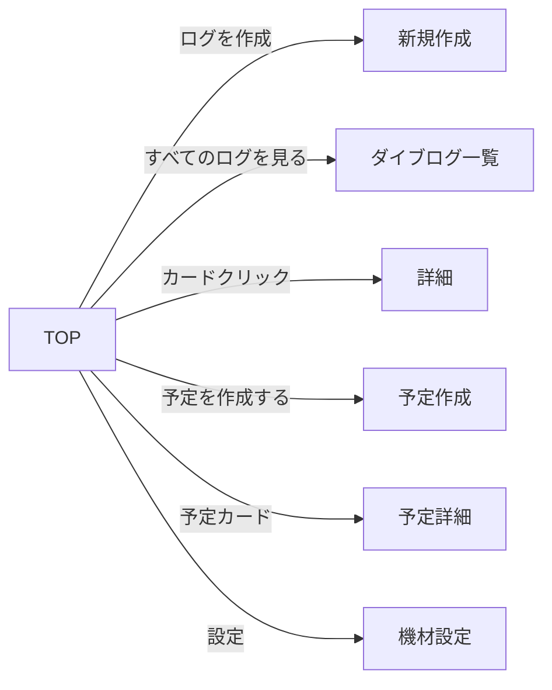

# TOP（ダッシュボード）

> **ステータス: 確定** — 003-dashboard 設計時に主要 TBD は解消済み。詳細は [`../spec.md`](../spec.md) / [`../plan.md`](../plan.md) を参照。

## メタ情報

| 項目 | 内容 |
|------|------|
| 画面ID | `top` |
| 関連機能 | [003 ダッシュボード](../spec.md) |
| ルート | `/` |
| 認証 | 必須（未認証は `/login` にリダイレクト。`src/proxy.ts` の `APP_ROUTE_PREFIXES` に `/` を追加） |
| 対応端末 | モバイル / タブレット / PC |
| ステータス | 実装済み（2026-06-11） |

## 1. 目的・概要

ログインしたダイバーが「自分のダイビング活動の今」を一目で把握するためのダッシュボード画面。

- 累計ダイブ本数・潜水時間を可視化することで、ダイバーとしての歩みを実感できる
- レギュレーターのオーバーホール期限を可視化することで、安全面のリマインダーになる
- 最近のログへの導線、新規記録への導線を提供することで、日常的な使い方の入口になる

## 2. 画面構成

### レイアウト（モバイル・feat/design-change 刷新後）

```
┌──────────────────────────────────┐
│ Header（ロゴのみ / SP はハンバーガー）│
├──────────────────────────────────┤
│ ▼ FV（全幅・背景写真 whale1.jpg）   │
│ ようこそ、○○さん                  │
│ ┌───────────┐ ┌───────────┐      │
│ │ 総ダイブ数  │ │ 今年のダイブ │      │
│ └───────────┘ └───────────┘      │
│ ┌───────────┐ ┌────────────────┐ │
│ │ 最大水深    │ │ ブランク  最終潜水日│ │
│ └───────────┘ └────────────────┘ │
│ 次のダイビング予定    [予定を作成する]│
│ [ 7/19（日）— 大瀬崎    あと 12 日 ]│
│        [残りログ枠 N]              │
│        [ ログを作成 ]（中央・大）    │
├──────────────────────────────────┤
│ 次のダイビング予定（一覧・最大 5 件） │
├──────────────────────────────────┤
│ ▼ 最近のダイブログ（全幅・背景 whale2）│
│ [写真+概要カード ×3（md: 3 カラム）] │
│        [ すべてのログを見る ]（中央） │
├──────────────────────────────────┤
│ [タイムライン | いいねしたログ] タブ │
├──────────────────────────────────┤
│ レギュレーター OH 状況              │
├──────────────────────────────────┤
│ 統計の推移                         │
└──────────────────────────────────┘
```

### 画面要素

| ID | 要素 | 種別 | 内容 |
|----|------|------|------|
| E1 | FV ヒーロー（`DashboardHero`） | 全幅セクション | 背景写真（`public/whale1.jpg`）+ スクリムの上に、挨拶（h1）/ FV 統計（E2）/ 次の予定 1 件（E8）/ 残枠バッジ（E7）/ 「ログを作成」CTA（中央・大） |
| E2 | FV 統計 | すりガラスパネル×4（2 カラム） | 総ダイブ数 / 今年のダイブ / 最大水深 / ブランク（右側に「最終潜水日: YYYY/MM/DD」を併記。009 参照） |
| E3 | レギュレーターパネル | カード | OH 状況サマリー（後述） |
| E4 | 最近のログ | カードグリッド | 直近 **3 件**。代表写真（cover 優先・なければ表示順先頭、写真なしはロゴのダミー画像）+ 日付・潮回り・ポイント名・最大水深・潜水時間。全幅の背景写真（`whale2.jpg`）セクション内に表示 |
| E5 | 一覧へのボタン | ボタン（default / lg） | 「すべてのログを見る」。E4 の下・中央配置 |
| E6 | 統計の推移 | チャート | 010-stats-expansion で実装（年別・月別グラフ + 代替テーブル） |
| E7 | 残枠バッジ | `CreditBalanceBadge`（リンク） | `残りログ枠 N`。FV 内「ログを作成」ボタンの直上・中央。`/settings/log-credits`（購入ページ）への導線を兼ねる（026 で追加） |
| E8 | FV 次の予定 | 見出し + ストリップ | 「次のダイビング予定」見出し + 「予定を作成する」ボタン + 直近 1 件（予定日（曜日付き）— 行き先 / 残り日数）。予定詳細へのリンク。予定なしは空メッセージ（004 参照）。**当日（予定日 = 今日）の予定がある場合**は見出しが「今日のダイビング予定」に切り替わり、ストリップの代わりに詳細カード（`NextPlanCardView variant="hero"`・持ち物チェックリスト付き。FV の他要素と同じすりガラス配色）を表示し、「予定を作成する」ボタンは表示しない（カード内の導線に集中させる）。持ち物準備が完了中の予定はカード右ペインが忘れ物確認リストに置き換わる（037） |
| E9 | 次の予定セクション | 一覧（`NextPlanList`・最大 5 件） | FV 下の本文に簡素な一覧（予定日（曜日付き）— 行き先 / 残り日数バッジ。行は予定詳細へのリンク）を最大 5 件表示。持ち物の準備は表示しない（持ち物付き詳細カードは FV の当日表示のみ）。当日の予定は FV（E8）に表示するためこのセクションからは除外し、残りの将来の予定のみを表示する。0 件時は空メッセージ |
| E10 | タイムラインタブ | タブ（WAI-ARIA Tabs） | 「タイムライン / いいねしたログ」を遷移なしでその場切り替え（021 / 027 参照） |

> 見出しは共通コンポーネント `Heading`（`@/shared/components/typography/Heading`。h2/h3 は sky→cyan のグラデーションバー付き）を使用する。

## 3. 累計潜水時間機能

### 計算ロジック

| 指標 | 計算式 |
|------|-------|
| 累計ダイブ本数 | `count(*) from dives where user_id = auth.uid()` |
| 累計潜水時間 | `sum(bottom_time_min) from dives where user_id = auth.uid()` |
| 最大水深 | `max(max_depth_m) from dives where user_id = auth.uid()` |
| 訪問スポット数 | `count(distinct coalesce(dive_site_id::text, location)) from dives where user_id = auth.uid()`（サイト参照または自由入力の distinct カウント） |

### 表示

feat/design-change で TOP の統計表示は FV 統計 4 項目に再構成された（集計 RPC 自体は従来どおり）:

- 総ダイブ数: `XX 本`
- 今年のダイブ: `XX 本`（`get_dive_yearly_counts` の当年値）
- 最大水深: `XX m`（小数はそのまま）
- ブランク: `XX 日` + 右側に `最終潜水日: YYYY/MM/DD`（ログ 0 件は値「—」・最終潜水日非表示）
- 集計取得に失敗した項目は「—」表示に落とし、FV 全体は必ず表示する
- 累計潜水時間・訪問スポット数は RPC（`get_dive_stats`）では引き続き集計されるが、TOP には表示しない

### 取得方針

- Server Component で 1 回の RPC（または 1 クエリ）で集計値をまとめて取得する
- 件数が少ないうちは都度集計で十分。1000 件超を想定するなら **マテリアライズドビュー** や **集計キャッシュテーブル** を検討（🟡 TBD: Phase 1 では都度集計でいくか → **003-dashboard では都度集計（RPC `get_dive_stats()`）で確定**）

### スキーマへの影響

- 既存 `dives` のみで実装可能。追加のテーブルは不要

## 4. レギュレーターのオーバーホール機能

### コンセプト

PADI / 各メーカー推奨「1 年または 100 ダイブごとに OH」をリマインドする。ユーザーが前回 OH 日と機材情報を登録すると、TOP に「次回推奨日」と「残日数 / 残本数」が表示される。

### データモデル提案

#### 案 A: 1 ユーザー 1 レギュレーター（`user_details` に列追加）

`user_details` テーブルに以下を追加:
- `regulator_name text`
- `regulator_last_overhauled_on date`
- `regulator_overhaul_interval_months int default 12`
- `regulator_overhaul_interval_dives int default 100`

**メリット**: テーブル追加なし、シンプル
**デメリット**: 複数機材（バックアップ・ドライ用など）に対応できない

#### 案 B: 別テーブル `regulators`（複数機材対応）

```sql
create table public.regulators (
    id uuid primary key default gen_random_uuid(),
    user_id uuid not null references public.users(id) on delete cascade,
    brand text,
    model text,
    purchased_on date,
    last_overhauled_on date,
    overhaul_interval_months integer not null default 12 check (overhaul_interval_months > 0),
    overhaul_interval_dives integer not null default 100 check (overhaul_interval_dives > 0),
    is_primary boolean not null default false,
    notes text,
    created_at timestamptz not null default now(),
    updated_at timestamptz not null default now()
);
```

**メリット**: 複数機材対応、将来の拡張に強い
**デメリット**: 1 機材しか持たない人にとってはオーバースペック

🟡 **TBD: 案 A / 案 B どちらで進めるか** → **案 B で確定**（拡張性 + ダイバーは 2 本目を持つことが普通）。確定後のカラム定義・制約は [`../plan.md`](../plan.md) のデータモデル節を参照。

### 計算ロジック

```
nextOverhaulDate = last_overhauled_on + overhaul_interval_months（カレンダー）
nextOverhaulDive = OH 以降の dive 本数 ≥ overhaul_interval_dives
```

| ステータス | 条件 |
|----------|------|
| **余裕** | 残日数 > 30 かつ 残本数 > 10 |
| **期限間近** | 残日数 ≤ 30 または 残本数 ≤ 10（どちらかが該当） |
| **期限切れ** | 残日数 ≤ 0 または 残本数 ≤ 0 |

🟡 **TBD: 閾値（30 日 / 10 本）はこれでいいか** → **この閾値で確定**

### 表示

- 余裕: 通常色（青系）
- 期限間近: 警告色（黄系）+ 「そろそろオーバーホールの時期です」
- 期限切れ: エラー色（赤系）+ 「オーバーホール推奨日を過ぎています」+ アイコン

### CTA

- 「設定する」: 未登録時
- 「メンテ完了を記録」: OH 実施日を更新するアクション（🟡 TBD: TOP に置くか、`/settings/equipment` に置くか → **TOP の OH カードに配置で確定**）

## 5. 状態（State）

| 状態 | 条件 | 表示 |
|------|------|------|
| 通常 | 認証済み・ログあり・レギュレーター登録あり | フル表示 |
| ログ 0 件 | 認証済みだがダイブログがない | FV 統計は「0」（ブランクは「—」）、最近のログは「最初のログを記録しよう」 CTA、レギュレーターも非表示 or 設定誘導 |
| レギュレーター未登録 | OH 未設定 | E3 を「レギュレーター情報を登録すると OH 期限をお知らせします」+ 設定 CTA に置き換え |
| ローディング | 集計クエリ実行中 | スケルトン UI |
| 未認証 | セッションなし | 🟡 TBD: `/login` リダイレクト / ランディングページ表示 → **`/login` リダイレクトで確定** |

## 6. 操作・遷移

| 操作 | トリガー | 遷移先 |
|------|---------|--------|
| 新規ログ作成 | E1 の「ログを作成」（中央・大） | `/dives/new` |
| ログ一覧 | E5 の「すべてのログを見る」 | `/dives` |
| ログ詳細 | E4 のカード | `/dives/[id]` |
| 予定作成 | E8 / E9 の「予定を作成する」（常時表示） | `/plans/new` |
| 予定詳細 | E8 のストリップ / E9 のカード | `/plans/[id]` |
| 予定一覧 | E9 見出し行の「すべての予定」 | `/plans` |
| 購入ページ | E7 の残枠バッジ | `/settings/log-credits` |
| レギュレーター設定 | E3 の「設定」 | `/settings/equipment`（🟡 TBD: ルート名 → **`/settings/equipment` で確定**） |

> 「保有資格を管理」の FV 導線は feat/design-change で削除（`/settings/certifications` へはヘッダーのアカウントメニューから到達）。

### 画面遷移図



## 7. アクセシビリティ要件

- 見出し階層: h1（ヒーロー）→ h2（各セクション）
- 統計カードは `<dl><dt><dd>` または `<section aria-labelledby>` で意味づけ
- レギュレーターのステータスは色だけに依存しない（アイコン + テキストでも判別可能に）
- 期限切れ警告は `role="status"` または `role="alert"`（緊急度に応じて）
- カードリストは `<ul role="list">` / `<li>`
- カラーコントラスト比 4.5:1 以上（警告色は注意）

詳細は `rules/accessibility.md` に準拠。

## 8. レスポンシブ

| ブレークポイント | レイアウト |
|---------------|----------|
| `< 640px` | 1 カラム。FV 統計は 2×2 グリッド、最近のログは 1 カラム |
| `>= 640px` | 最近のログは 2 カラム |
| `>= 768px` | 最近のログは 3 カラム。ヘッダーはテキストナビ表示（未満はハンバーガー） |
| 共通 | 本文は最大幅 `max-w-5xl`・中央寄せ。FV と「最近のダイブログ」は背景写真をビューポート全幅（full-bleed）に敷く |

## 9. 表示条件・権限

- 認証必須（middleware で `/` も認証必須に追加する 🟡 TBD or page 内で `redirect('/login')` → **`src/proxy.ts` の `APP_ROUTE_PREFIXES` に `/` を追加で確定**）
- 表示データは `auth.uid()` のもののみ（RLS で保証）

## 10. 関連リソース

### 既存

- 関連機能（本 feature）: [`../spec.md`](../spec.md) / [`../plan.md`](../plan.md) / [`../tasks.md`](../tasks.md)
- 関連機能: [`specs/002-dive-log-crud/`](../../002-dive-log-crud/spec.md)
- 関連テーブル: [`dives`](../../002-dive-log-crud/data-model.md) / [`users` / `user_details`](../../001-auth/data-model.md)
- 関連画面: [`dive-list.md`](../../002-dive-log-crud/screens/dive-list.md) / [`dive-detail.md`](../../002-dive-log-crud/screens/dive-detail.md) / [`dive-new.md`](../../002-dive-log-crud/screens/dive-new.md)

### 新規（このスペック確定後に作成）

> 注: 初版時点では「003-regulator-overhaul」「004-dive-stats」と分割する案だったが、最終的に **003-dashboard に統合** された（[`../spec.md`](../spec.md) が両機能を含む）。

- 機能仕様: ~~`specs/features/003-regulator-overhaul/`~~ → [`../spec.md`](../spec.md) に統合
- 機能仕様: ~~`specs/features/004-dive-stats/`（累計統計）~~ → [`../spec.md`](../spec.md) に統合
- テーブル仕様: `specs/003-dashboard/data-model.md`（regulators テーブル。案 B 採用で確定。マイグレーション確定後に作成 — tasks.md T041）

## 11. 未確定事項（🟡 TBD まとめ）

初版時点の TBD と、003-dashboard 設計での確定結果:

| # | 項目 | 確定結果 |
|---|------|---------|
| 1 | 未認証時の挙動: TOP は認証必須 / 未認証はランディング or `/login` | **認証必須・`/login` リダイレクト** |
| 2 | レギュレーターのデータモデル: 案 A（user_details 拡張） / 案 B（regulators テーブル新規） | **案 B（`regulators` テーブル新規）** |
| 3 | OH 警告閾値: 残日数 30 日 / 残本数 10 本でいいか | **この閾値で確定** |
| 4 | OH 完了記録アクション: TOP に置くか機材設定画面に置くか | **TOP の OH カードに配置** |
| 5 | 月別グラフ: Phase 1 で実装するか後回しか | **対象外（後続 feature で検討）** |
| 6 | 集計戦略: 都度集計で問題ないか、キャッシュ層を入れるか | **都度集計（RPC で DB 側集計）** |
| 7 | タブレット以上のレイアウト: 2 カラム化するか縦長 1 カラムを維持するか | 🟡 未確定（実装時に判断） |

このほか「累計潜水時間の 100 時間超の丸め」も 🟡 未確定（実装時に判断）。

## 12. 変更履歴

| 日付 | 変更内容 | 担当 |
|------|---------|------|
| 2026-05-27 | 初版作成（ドラフト） | - |
| 2026-08-07 | 当日の予定の FV 表示を追加: 予定日 = 今日の予定がある場合、FV の見出しを「今日のダイビング予定」に切り替えて詳細カード（持ち物準備付き）を表示し、FV 下のセクションからは当日の予定を除外する。あわせて FV 下を詳細カード最大 3 件 → 簡素な一覧（`NextPlanList`・持ち物なし）最大 5 件に変更 | - |
| 2026-06-10 | spec-kit 形式への移行に伴い `specs/003-dashboard/screens/top.md` に複製・リンク書き換え・TBD 確定結果を追記 | - |
| 2026-06-12 | 006 保有資格管理の導線追加に伴い、ヒーローに「保有資格を管理」（`/settings/certifications`）を追記 | - |
| 2026-07-08 | feat/design-change のデザイン刷新を反映: FV ヒーロー（背景写真 + FV 統計 4 項目 + 次の予定 + 中央 CTA）、最近のログ 3 件 3 カラム + 代表写真、タイムライン / いいねタブのインライン切替、保有資格導線の削除、Heading 共通化 | - |
