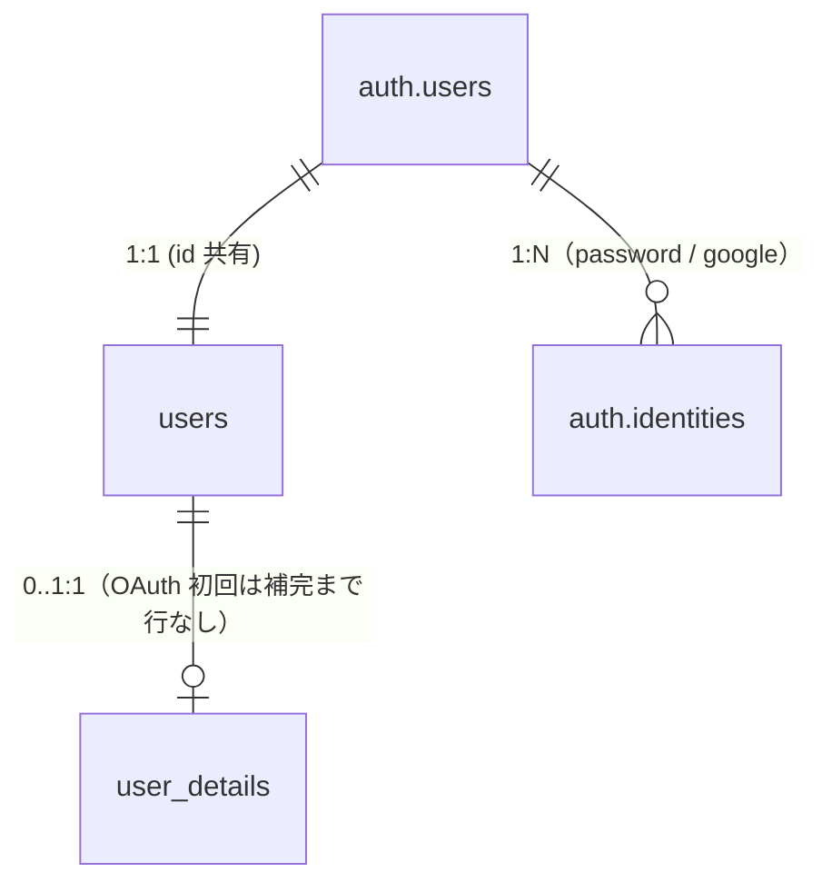

# Data Model: 認証（Google ログイン / ソーシャルログイン）

**Feature**: [spec.md](spec.md) | **Plan**: [plan.md](plan.md)

本機能は新規テーブルを追加しない。既存の `public.users` / `public.user_details`（[001-auth/data-model.md](../001-auth/data-model.md) が正）を再利用し、**`handle_new_user` トリガーの分岐**と **`user_details` への INSERT ポリシー追加** の 2 点だけを変更する。認証手段（メール+パスワード / Google）は Supabase の `auth.identities` が保持し、アプリ側テーブルは増やさない。

## ER（変更なし）



> 変更点: `users` ↔ `user_details` の関係は実質 1:1 だが、**OAuth 初回サインアップからプロフィール補完までの間だけ `user_details` 行が存在しない**状態を取りうる（「行なし＝未補完」）。

---

## 変更 1: `handle_new_user()` トリガーの分岐

### 目的

Google OAuth の初回サインアップでは `raw_user_meta_data` に `user_details` の NOT NULL 列（`last_name` / `nickname` / `birth_on` ほか）が存在しないため、現行トリガーのままでは制約違反で `auth.users` の INSERT 自体が失敗する。これを防ぐため、`user_details` の挿入を **メールサインアップ経路のみ**に限定する。

### 変更後の挙動

| サインアップ経路 | `raw_user_meta_data ? 'nickname'` | `public.users` | `public.user_details` |
|------------------|-----------------------------------|----------------|------------------------|
| メール + パスワード（既存） | true | 挿入 | 挿入（従来どおり） |
| Google OAuth 初回 | false | 挿入 | **挿入しない**（補完で作成） |
| Google OAuth で既存メールに自動紐付け | （新規 INSERT が起きない） | — | — |

### マイグレーション方針

新規ファイル `supabase/migrations/<ts>_alter_handle_new_user_for_oauth.sql` で `handle_new_user()` を `create or replace`。`public.users` の挿入は無条件、`user_details` の挿入を `if new.raw_user_meta_data ? 'nickname' then ... end if;` で囲う。`security definer set search_path = ''` と参照のスキーマ修飾（`public.*`）は維持する（`sql.md` の search_path injection 対策）。トリガー（`on_auth_user_created`）自体は再作成不要。

```sql
-- 擬似コード（実装は tasks フェーズ）
create or replace function public.handle_new_user()
returns trigger
language plpgsql
security definer set search_path = ''
as $$
begin
    insert into public.users (id) values (new.id);

    -- メールサインアップ経路のみ user_details を作成する。
    -- OAuth 初回は nickname 等が無いため作らず、/profile-completion で補完する。
    if new.raw_user_meta_data ? 'nickname' then
        insert into public.user_details (
            user_id, last_name, first_name, last_name_romaji, first_name_romaji,
            nickname, birth_on, gender, height_cm, weight_kg
        )
        values (
            new.id,
            new.raw_user_meta_data->>'last_name',
            new.raw_user_meta_data->>'first_name',
            new.raw_user_meta_data->>'last_name_romaji',
            new.raw_user_meta_data->>'first_name_romaji',
            new.raw_user_meta_data->>'nickname',
            (new.raw_user_meta_data->>'birth_on')::date,
            coalesce(new.raw_user_meta_data->>'gender', 'unanswered'),
            nullif(new.raw_user_meta_data->>'height_cm', '')::numeric,
            nullif(new.raw_user_meta_data->>'weight_kg', '')::numeric
        );
    end if;

    return new;
end;
$$;
```

---

## 変更 2: `user_details` への INSERT RLS ポリシー追加

### 目的

OAuth ユーザーのプロフィール補完は Server Action `completeProfile()` がアプリから `user_details` に直接 INSERT する。これを本人行に限って許可する。

### 追加ポリシー

| ポリシー名 | コマンド | 条件 |
|------------|---------|------|
| `users can insert own details` | `INSERT` | `with check ((select auth.uid()) = user_id)` |

- 既存の SELECT / UPDATE ポリシー（本人限定）は変更しない。
- PK = `user_id` のため、補完済みユーザーが再 INSERT を試みても一意制約違反で弾かれ、二重作成は構造的に防がれる。
- `auth.uid()` は `(select auth.uid())` で包む（`sql.md` の `auth_rls_initplan` 対策）。
- メールサインアップ経路は引き続きトリガー（SECURITY DEFINER）が挿入するため、このポリシーの影響を受けない。

```sql
-- 擬似コード
create policy "users can insert own details"
    on public.user_details for insert
    with check ((select auth.uid()) = user_id);
```

---

## バリデーション（補完フォーム = `001-auth` サインアップと同基準）

`completeProfile()` が INSERT する値は DB の CHECK 制約と一致させる（[contracts/profile-completion-schema.md](contracts/profile-completion-schema.md) 参照）。

| 項目 | ルール（DB CHECK と一致） |
|------|---------------------------|
| `last_name` / `first_name` | 必須・`length(trim()) > 0`・50 文字以内（アプリ側） |
| `last_name_romaji` / `first_name_romaji` | 必須・半角英字のみ・50 文字以内（アプリ側）・空白のみ不可 |
| `nickname` | 必須・50 文字以内・空白のみ不可 |
| `birth_on` | 必須・`>= 1900-01-01` かつ `<= (now() at time zone 'Asia/Tokyo')::date`（JST 基準） |
| `gender` | `male` / `female` / `unanswered` の 3 択（既定 `unanswered`） |
| `height_cm` / `weight_kg` | 任意・範囲制約あり・空は `NULL` に正規化 |

---

## 運用ノート / リスク

- **既存ユーザー無影響**: メールサインアップは `nickname` を必ず meta に含むため従来どおり `user_details` が作られる。
- **自動紐付け**: 同一の確認済みメールを持つ Google ログインは新規 `auth.users` を作らず既存に紐付くため、トリガーは発火せず既存 `user_details` が維持される（補完不要）。
- **補完前の離脱**: OAuth 初回で補完せず離脱したユーザーは `user_details` 行が無い状態で残る。次回ログイン時も `(authenticated)` レイアウトが `/profile-completion` へ誘導するため、データ不整合にはならない。
- **`gender` 拡張時**: DB CHECK とアプリ側 `GENDER_VALUES`（`shared/constants/gender.ts`）の両方を更新する（`001-auth` と同様）。

## 関連リソース

- 既存定義（正）: [001-auth/data-model.md](../001-auth/data-model.md)
- 既存マイグレーション: `supabase/migrations/20260514120000_create_user_details.sql`
- 追加マイグレーション: `supabase/migrations/<ts>_alter_handle_new_user_for_oauth.sql`（tasks フェーズで作成）
- 型 / スキーマ: `service-front/src/features/auth/schemas/profile-completion.schema.ts`（新規）
